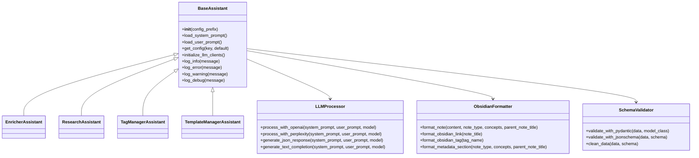
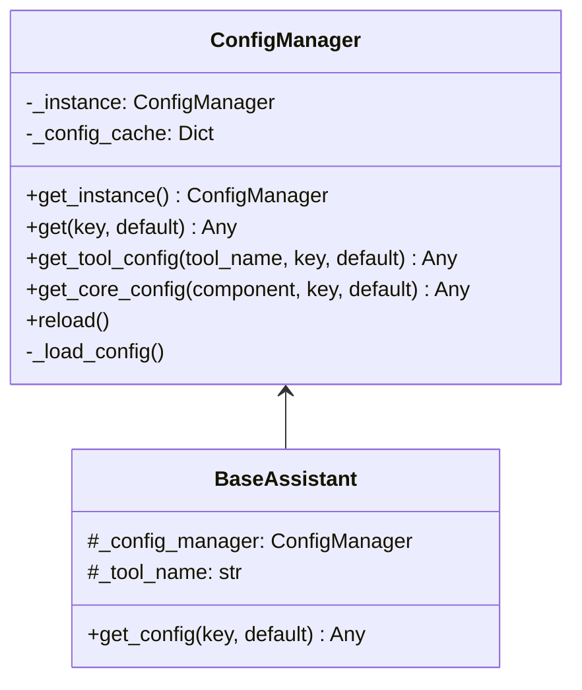
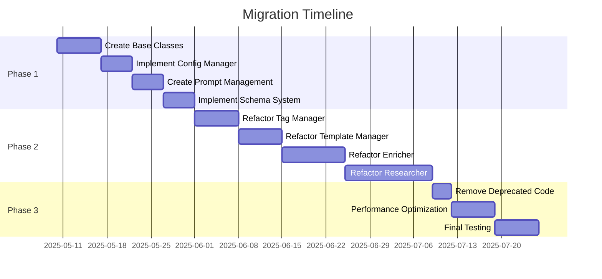
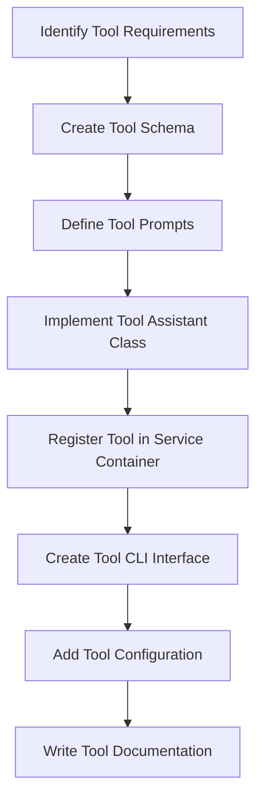

# Obsidian Suite Standardization Plan

## Table of Contents
- [Introduction](#introduction)
- [Current Architecture Analysis](#current-architecture-analysis)
- [Proposed Architecture](#proposed-architecture)
- [Configuration Management](#configuration-management)
- [Migration Strategy](#migration-strategy)
- [Supporting New Tools](#supporting-new-tools)
- [Refactoring Steps](#refactoring-steps)
- [Benefits of the New Architecture](#benefits-of-the-new-architecture)
- [Conclusion](#conclusion)

## Introduction

This document outlines a comprehensive plan for standardizing and centralizing the Obsidian suite tools. The goal is to reduce code duplication, establish consistent patterns, and create a modular architecture that allows for easy maintenance and extension.

## Current Architecture Analysis

### Core Modules
The codebase already has some core modules that provide shared functionality:
- **config**: Centralized configuration loading from YAML and environment variables
- **file_io**: Basic file operations (scan_directory, read_file, write_file)
- **llm**: Clients for OpenAI and Perplexity APIs
- **obsidian**: Formatter and parser for Obsidian notes
- **logging**: Centralized logging setup
- **utils**: Text utilities

### Tools Implementation
Each tool follows a similar pattern but with inconsistencies:
1. **Enricher**: 
   - Uses both OpenAI and ResearchAssistant
   - Has simple and advanced enrichment modes
   - Defines its own JSON schema using Pydantic

2. **Researcher**:
   - Uses both OpenAI and Perplexity
   - Has a two-stage process (planning and content generation)
   - Uses Pydantic for data validation

3. **Tag Manager**:
   - Uses only OpenAI
   - Processes tags across multiple notes
   - Uses jsonschema for validation

4. **Template Manager**:
   - Uses only OpenAI
   - Processes individual notes
   - Uses jsonschema for validation

### Common Patterns Identified
1. **LLM Client Initialization**: Each tool initializes its own LLM clients
2. **Prompt Management**: Each tool defines and loads its own prompts
3. **JSON Schema Definition**: Each tool defines its own schemas (some using Pydantic, others using jsonschema)
4. **Obsidian Formatting**: Each tool formats Obsidian notes slightly differently
5. **Error Handling**: Similar error handling patterns across tools
6. **Configuration Loading**: Similar configuration loading patterns

### Duplicated Code
1. Loading system and user prompts from config or defaults
2. Initializing LLM clients
3. JSON validation and cleaning
4. Formatting Obsidian notes
5. Error handling and logging
## Proposed Architecture

We propose a modular architecture that standardizes these common patterns while maintaining clear separation of concerns.

### 1. Base Classes and Interfaces



### 2. Standardized Prompt Management

Create a centralized prompt management system:

```python
# src/core/prompts/manager.py
class PromptManager:
    """Manages loading and caching of prompts."""
    
    def __init__(self, config_prefix):
        self.config_prefix = config_prefix
        self.cache = {}
        
    def get_system_prompt(self, prompt_name, default_prompt=None):
        """Gets a system prompt by name, from config or default."""
        cache_key = f"system_{prompt_name}"
        if cache_key in self.cache:
            return self.cache[cache_key]
            
        # Try to load from config
        config_key = f"{self.config_prefix}.system_prompts.{prompt_name}"
        prompt_path = get_config(config_key)
        
        if prompt_path and os.path.exists(prompt_path):
            try:
                prompt = read_file(prompt_path)
                self.cache[cache_key] = prompt
                return prompt
            except Exception as e:
                logger.error(f"Error loading prompt from {prompt_path}: {e}")
                
        # Use default if provided
        if default_prompt:
            self.cache[cache_key] = default_prompt
            return default_prompt
            
        raise ValueError(f"No prompt found for {prompt_name}")
        
    def get_user_prompt(self, prompt_name, default_prompt=None):
        """Gets a user prompt by name, from config or default."""
        # Similar implementation as get_system_prompt
```

### 3. Unified JSON Schema Definitions

Create a centralized schema management system:

```python
# src/core/schemas/base.py
from pydantic import BaseModel, Field

class BaseSchema(BaseModel):
    """Base class for all schemas."""
    pass

# src/core/schemas/obsidian.py
class ObsidianNote(BaseSchema):
    """Schema for an Obsidian note."""
    title: str = Field(..., description="The title of the note")
    content: str = Field(..., description="The content of the note")
    note_type: str = Field("note", description="The type of the note")
    concepts: List[str] = Field(default_factory=list, description="List of concepts")
    parent_note_title: Optional[str] = Field(None, description="The title of the parent note")

# src/core/schemas/enricher.py
class EnrichmentOutput(BaseSchema):
    """Schema for enrichment output."""
    enriched_content: str = Field(..., description="The enriched content")
    concepts: List[str] = Field(default_factory=list, description="List of concepts")

# Additional schemas for other tools...
```

### 4. Standardized LLM Client Interface

Create a unified LLM client interface:

```python
# src/core/llm/client.py
class LLMClient:
    """Unified interface for LLM clients."""
    
    def __init__(self, client_type="openai"):
        """Initialize the appropriate LLM client."""
        self.client_type = client_type
        if client_type == "openai":
            self.client = OpenAIClient()
        elif client_type == "perplexity":
            self.client = PerplexityClient()
        else:
            raise ValueError(f"Unknown client type: {client_type}")
            
    def generate_text(self, system_prompt, user_prompt, model=None, **kwargs):
        """Generate text using the appropriate client."""
        if self.client_type == "openai":
            return self.client.generate_text_completion(
                system_prompt=system_prompt,
                user_prompt=user_prompt,
                model=model,
                **kwargs
            )
        elif self.client_type == "perplexity":
            result = self.client.generate_text_completion(
                system_prompt=system_prompt,
                user_prompt=user_prompt,
                model=model,
                **kwargs
            )
            return result.get("content") if "content" in result else None
            
    def generate_json(self, system_prompt, user_prompt, model=None, json_schema=None, **kwargs):
        """Generate JSON using the appropriate client."""
        # Similar implementation as generate_text
```

### 5. Consistent Obsidian File Formatting

Enhance the existing formatter to be more comprehensive:

```python
# src/core/obsidian/formatter.py (enhanced)
class ObsidianFormatter:
    """Comprehensive formatter for Obsidian notes."""
    
    @staticmethod
    def format_note(content, note_type, concepts, parent_note_title=None):
        """Format a complete note with metadata."""
        # Implementation
        
    @staticmethod
    def format_frontmatter(metadata):
        """Format frontmatter from a metadata dictionary."""
        # Implementation
        
    @staticmethod
    def format_obsidian_link(note_title):
        """Format an Obsidian link."""
        # Implementation
        
    @staticmethod
    def format_obsidian_tag(tag_name):
        """Format an Obsidian tag."""
        # Implementation
```

### 6. Dependency Management Between Tools

Create a service locator or dependency injection system:

```python
# src/core/di/container.py
class ServiceContainer:
    """Simple service locator for dependency management."""
    
    _instances = {}
    
    @classmethod
    def register(cls, service_name, instance):
        """Register a service instance."""
        cls._instances[service_name] = instance
        
    @classmethod
    def get(cls, service_name):
        """Get a service instance."""
        if service_name not in cls._instances:
            raise ValueError(f"Service {service_name} not registered")
        return cls._instances[service_name]
        
    @classmethod
    def has(cls, service_name):
        """Check if a service is registered."""
        return service_name in cls._instances
```
## Configuration Management

The current approach has each tool accessing configuration directly through `get_config()`, which works but leads to scattered configuration access and potential duplication. Here's a more robust approach:



### Implementation Details:

```python
# src/core/config/manager.py
class ConfigManager:
    """Singleton manager for configuration access."""
    
    _instance = None
    
    @classmethod
    def get_instance(cls):
        """Get the singleton instance."""
        if cls._instance is None:
            cls._instance = cls()
        return cls._instance
    
    def __init__(self):
        """Initialize the config manager."""
        self._config_cache = {}
        self._load_config()
    
    def _load_config(self):
        """Load configuration from files and environment."""
        # Use existing loader.py functionality
        from src.core.config.loader import load_config
        self._config_cache = load_config()
    
    def reload(self):
        """Reload configuration."""
        self._load_config()
    
    def get(self, key, default=None):
        """Get a configuration value."""
        # Use existing get_config functionality
        from src.core.config.loader import get_config
        return get_config(key, default)
    
    def get_tool_config(self, tool_name, key, default=None):
        """Get a tool-specific configuration value."""
        full_key = f"{tool_name}.{key}"
        return self.get(full_key, default)
    
    def get_core_config(self, component, key, default=None):
        """Get a core component configuration value."""
        full_key = f"core.{component}.{key}"
        return self.get(full_key, default)
```

### Configuration Structure:

We'll standardize the configuration structure in `settings.yaml`:

```yaml
# Core components configuration
core:
  llm:
    default_openai_model: "gpt-4o-mini"
    default_perplexity_model: "sonar-small-32k-online"
    request_timeout: 60
  
  obsidian:
    default_note_type: "note"
    allowed_note_types:
      - "note"
      - "category"
      - "main"
      - "sub"
      - "sensitive"
      - "person"
      - "log"
  
  prompts:
    directory: "./prompts"

# Tool-specific configuration
enricher:
  simple_model: "gpt-4.1-nano"
  output_dir: "/home/yavuz/Documents/vault"
  system_prompts:
    simple_enrich: "./prompts/enricher/simple_enrich_system.txt"
    advanced_research: "./prompts/enricher/advanced_research_system.txt"

researcher:
  openai_model: "gpt-4.1-nano"
  perplexity_model: "sonar-pro"
  output_dir: "/home/yavuz/Documents/vault"
  request_timeout: 1200
  system_prompts:
    planning: "./prompts/researcher/planning_system.txt"
    content_gen: "./prompts/researcher/content_gen_system.txt"

tag_manager:
  exempt_tags:
    - "#note"
    - "#category"
    - "#main"
    - "#sub"
    - "#sensitive"
    - "#person"
    - "#log"
  llm_model: "gpt-4o-mini"
  system_prompts:
    standardization: "./prompts/tag_manager/standardization_system.txt"

template_manager:
  allowed_note_types:
    - "note"
    - "category"
    - "main"
    - "sub"
    - "sensitive"
    - "person"
    - "log"
  llm_model: "gpt-4o-mini"
  system_prompts:
    template: "./prompts/template_manager/template_system.txt"
```

### Usage in Tools:

```python
# In BaseAssistant
def __init__(self, tool_name):
    self._config_manager = ConfigManager.get_instance()
    self._tool_name = tool_name
    
def get_config(self, key, default=None):
    """Get a tool-specific configuration value."""
    return self._config_manager.get_tool_config(self._tool_name, key, default)

# In EnricherAssistant
def __init__(self):
    super().__init__("enricher")
    self.simple_enrich_model = self.get_config("simple_model", "gpt-4.1-nano")
    self.output_dir = self.get_config("output_dir", "/home/yavuz/Documents/vault")
```
## Migration Strategy

To migrate from the current architecture to the new one with minimal disruption, we recommend a phased approach:

### Phase 1: Create Core Infrastructure Without Breaking Changes

1. **Create New Base Classes and Interfaces**:
   - Implement all new base classes and interfaces
   - Ensure they can work alongside existing code
   - Don't modify existing tools yet

2. **Implement Configuration Manager**:
   - Create the new ConfigManager class
   - Make it compatible with the existing get_config function
   - Test it thoroughly with existing configuration

3. **Create Prompt Management System**:
   - Implement the PromptManager class
   - Set up the prompt directory structure
   - Extract existing prompts to files

4. **Implement Schema System**:
   - Create base schema classes
   - Define common schemas
   - Test schema validation

### Phase 2: Refactor One Tool at a Time

5. **Start with the Simplest Tool (Tag Manager)**:
   - Create a new implementation that extends BaseAssistant
   - Run it alongside the existing implementation
   - Test thoroughly to ensure identical behavior
   - Switch to the new implementation when ready

6. **Refactor Template Manager**:
   - Follow the same approach as with Tag Manager
   - Ensure backward compatibility
   - Test thoroughly

7. **Refactor Enricher**:
   - Create new implementation
   - Test alongside existing implementation
   - Switch when ready

8. **Refactor Researcher (Most Complex)**:
   - Create new implementation
   - Test thoroughly
   - Switch when ready

### Phase 3: Clean Up and Finalize

9. **Remove Deprecated Code**:
   - Remove old implementations
   - Update documentation
   - Finalize tests

10. **Performance Optimization**:
    - Optimize the new architecture
    - Add caching where appropriate
    - Ensure efficient resource usage

### Migration Timeline:



### Backward Compatibility Strategy:

To ensure minimal disruption during migration:

1. **Adapter Pattern**: Create adapters for new components to work with old code
2. **Feature Flags**: Use configuration flags to enable/disable new components
3. **Parallel Running**: Run old and new implementations side by side for comparison
4. **Comprehensive Testing**: Create tests that verify identical behavior
5. **Gradual Rollout**: Migrate one component at a time, starting with the simplest
## Supporting New Tools

The new architecture is designed to make adding new tools straightforward:

### Tool Creation Process:



### Example: Adding a New "Linker" Tool

Let's walk through adding a hypothetical new tool that automatically links related notes:

1. **Create Tool Schema**:

```python
# src/core/schemas/linker.py
from src.core.schemas.base import BaseSchema
from pydantic import Field
from typing import List, Dict

class LinkSuggestion(BaseSchema):
    """Schema for a link suggestion."""
    source_note: str = Field(..., description="The source note title")
    target_note: str = Field(..., description="The target note title")
    relevance_score: float = Field(..., description="The relevance score (0-1)")
    context: str = Field(..., description="The context for the link")

class LinkAnalysisResult(BaseSchema):
    """Schema for link analysis results."""
    suggestions: List[LinkSuggestion] = Field(..., description="List of link suggestions")
    summary: str = Field(..., description="Summary of the analysis")
```

2. **Define Tool Prompts**:

Create prompt files:
- `prompts/linker/analysis_system.txt`
- `prompts/linker/analysis_user.txt`

3. **Implement Tool Assistant Class**:

```python
# src/tools/linker/assistant.py
from src.core.base.assistant import BaseAssistant
from src.core.schemas.linker import LinkAnalysisResult, LinkSuggestion
from src.core.llm.client import LLMClient
from typing import List, Dict, Any, Optional

class LinkerAssistant(BaseAssistant):
    """Assistant for linking related notes."""
    
    def __init__(self):
        super().__init__("linker")
        self.llm_model = self.get_config("llm_model", "gpt-4o")
        self.min_relevance_score = self.get_config("min_relevance_score", 0.7)
        self.llm_client = LLMClient("openai")
        self.prompt_manager = self.get_prompt_manager()
        
    def analyze_notes(self, notes: List[Dict[str, Any]]) -> Optional[LinkAnalysisResult]:
        """Analyze notes and suggest links."""
        system_prompt = self.prompt_manager.get_system_prompt("analysis")
        
        # Prepare notes data for the prompt
        notes_data = "\n\n".join([
            f"Title: {note['title']}\nContent: {note['content'][:500]}..."
            for note in notes
        ])
        
        user_prompt = self.prompt_manager.get_user_prompt("analysis").format(
            notes_data=notes_data
        )
        
        # Get analysis from LLM
        result = self.llm_client.generate_json(
            system_prompt=system_prompt,
            user_prompt=user_prompt,
            model=self.llm_model,
            schema_class=LinkAnalysisResult
        )
        
        if not result:
            self.log_error("Failed to generate link analysis")
            return None
            
        # Filter suggestions by relevance score
        filtered_suggestions = [
            suggestion for suggestion in result.suggestions
            if suggestion.relevance_score >= self.min_relevance_score
        ]
        
        result.suggestions = filtered_suggestions
        return result
        
    def apply_links(self, notes: Dict[str, str], suggestions: List[LinkSuggestion]) -> Dict[str, str]:
        """Apply link suggestions to notes."""
        modified_notes = notes.copy()
        
        for suggestion in suggestions:
            source_note_content = modified_notes.get(suggestion.source_note)
            if not source_note_content:
                continue
                
            # Add link to the end of the note
            link_section = "\n\n## Related Notes\n"
            if "## Related Notes" not in source_note_content:
                modified_notes[suggestion.source_note] = source_note_content + link_section
                
            # Add the link
            link_line = f"- [[{suggestion.target_note}]] - {suggestion.context}\n"
            if link_line not in modified_notes[suggestion.source_note]:
                if link_section in modified_notes[suggestion.source_note]:
                    # Add after the section header
                    parts = modified_notes[suggestion.source_note].split(link_section, 1)
                    modified_notes[suggestion.source_note] = parts[0] + link_section + link_line + parts[1]
                else:
                    # Add to existing section
                    section_pattern = r"(## Related Notes\n)"
                    modified_notes[suggestion.source_note] = re.sub(
                        section_pattern,
                        r"\1" + link_line,
                        modified_notes[suggestion.source_note]
                    )
                    
        return modified_notes
```

4. **Register Tool in Service Container**:

```python
# src/core/di/setup.py
from src.core.di.container import ServiceContainer
from src.tools.linker.assistant import LinkerAssistant

def register_services():
    """Register all services in the container."""
    # Register core services
    # ...
    
    # Register tool services
    ServiceContainer.register("enricher", EnricherAssistant())
    ServiceContainer.register("researcher", ResearchAssistant())
    ServiceContainer.register("tag_manager", TagManagerAssistant())
    ServiceContainer.register("template_manager", TemplateManagerAssistant())
    ServiceContainer.register("linker", LinkerAssistant())
```

5. **Create Tool CLI Interface**:

```python
# src/tools/linker/main.py
import argparse
import sys
import os
from typing import List

from src.core.di.container import ServiceContainer
from src.core.file_io.utils import read_file, write_file, scan_directory
from src.core.logging.setup import get_logger

logger = get_logger(__name__)

def main():
    """Main entry point for the linker tool."""
    parser = argparse.ArgumentParser(description="Link related Obsidian notes.")
    parser.add_argument("--vault", "-v", required=True, help="Path to Obsidian vault")
    parser.add_argument("--apply", "-a", action="store_true", help="Apply suggested links")
    parser.add_argument("--min-score", "-m", type=float, default=0.7, help="Minimum relevance score")
    
    args = parser.parse_args()
    
    # Get the linker assistant from the service container
    linker = ServiceContainer.get("linker")
    
    # Scan the vault for notes
    note_files = scan_directory(args.vault, extension=".md")
    
    # Read note contents
    notes = []
    for file_path in note_files:
        try:
            content = read_file(file_path)
            title = os.path.splitext(os.path.basename(file_path))[0]
            notes.append({
                "title": title,
                "content": content,
                "path": file_path
            })
        except Exception as e:
            logger.error(f"Error reading note {file_path}: {e}")
    
    # Analyze notes
    logger.info(f"Analyzing {len(notes)} notes for potential links...")
    result = linker.analyze_notes(notes)
    
    if not result:
        logger.error("Failed to analyze notes")
        return 1
        
    # Display suggestions
    logger.info(f"Found {len(result.suggestions)} link suggestions")
    for suggestion in result.suggestions:
        logger.info(f"Link: {suggestion.source_note} -> {suggestion.target_note} (Score: {suggestion.relevance_score})")
        logger.info(f"Context: {suggestion.context}")
        logger.info("---")
    
    # Apply links if requested
    if args.apply:
        logger.info("Applying link suggestions...")
        
        # Create a dictionary of note titles to contents
        note_contents = {note["title"]: note["content"] for note in notes}
        
        # Apply links
        modified_contents = linker.apply_links(note_contents, result.suggestions)
        
        # Write modified notes
        for note in notes:
            title = note["title"]
            if title in modified_contents and modified_contents[title] != note["content"]:
                logger.info(f"Updating note: {title}")
                write_file(note["path"], modified_contents[title])
        
        logger.info("Links applied successfully")
    
    return 0

if __name__ == "__main__":
    sys.exit(main())
```

6. **Add Tool Configuration**:

```yaml
# settings.yaml (add to existing config)
linker:
  llm_model: "gpt-4o"
  min_relevance_score: 0.7
  system_prompts:
    analysis: "./prompts/linker/analysis_system.txt"
  user_prompts:
    analysis: "./prompts/linker/analysis_user.txt"
```

### Tool Integration Framework:

To further support new tools, we'll create a tool integration framework:

```python
# src/core/tools/registry.py
class ToolRegistry:
    """Registry for all available tools."""
    
    _tools = {}
    
    @classmethod
    def register_tool(cls, name, tool_class, description):
        """Register a tool."""
        cls._tools[name] = {
            "class": tool_class,
            "description": description
        }
        
    @classmethod
    def get_tool(cls, name):
        """Get a tool by name."""
        if name not in cls._tools:
            raise ValueError(f"Tool {name} not registered")
        return cls._tools[name]["class"]
        
    @classmethod
    def get_all_tools(cls):
        """Get all registered tools."""
        return cls._tools
        
    @classmethod
    def get_tool_description(cls, name):
        """Get a tool's description."""
        if name not in cls._tools:
            raise ValueError(f"Tool {name} not registered")
        return cls._tools[name]["description"]
```

### Tool Discovery:

```python
# src/core/tools/discovery.py
import importlib
import pkgutil
import inspect
from src.core.tools.registry import ToolRegistry
from src.core.base.assistant import BaseAssistant

def discover_tools():
    """Discover and register all tools."""
    import src.tools as tools_package
    
    for _, name, is_pkg in pkgutil.iter_modules(tools_package.__path__, tools_package.__name__ + "."):
        if is_pkg:
            try:
                # Import the tool package
                module = importlib.import_module(name)
                
                # Look for assistant module
                assistant_module_name = name + ".assistant"
                try:
                    assistant_module = importlib.import_module(assistant_module_name)
                    
                    # Find assistant classes
                    for item_name, item in inspect.getmembers(assistant_module):
                        if (inspect.isclass(item) and 
                            issubclass(item, BaseAssistant) and 
                            item != BaseAssistant):
                            
                            # Extract tool name from package name
                            tool_name = name.split(".")[-1]
                            
                            # Get description from class docstring
                            description = item.__doc__ or f"Tool for {tool_name}"
                            
                            # Register the tool
                            ToolRegistry.register_tool(tool_name, item, description)
                            print(f"Registered tool: {tool_name}")
                            
                except ImportError:
                    print(f"No assistant module found for {name}")
                    
            except ImportError as e:
                print(f"Error importing {name}: {e}")
```

This framework allows new tools to be automatically discovered and registered, making it easy to add new tools without modifying existing code.
## Refactoring Steps

Here's a detailed plan for implementing this architecture:

### Phase 1: Core Infrastructure

1. **Create Base Classes**:
   - Implement `BaseAssistant` abstract class
   - Implement `LLMProcessor` class
   - Implement `SchemaValidator` class
   - Enhance `ObsidianFormatter` class

2. **Implement Prompt Management**:
   - Create `PromptManager` class
   - Define standard prompt loading methods
   - Add caching for performance

3. **Standardize Schema Definitions**:
   - Create base schema classes using Pydantic
   - Define common schemas for all tools
   - Create tool-specific schema extensions

4. **Unify LLM Client Interface**:
   - Create `LLMClient` facade class
   - Implement methods for both OpenAI and Perplexity
   - Add error handling and retry logic

### Phase 2: Tool Refactoring

5. **Refactor Enricher**:
   - Extend `BaseAssistant`
   - Use standardized prompt management
   - Use unified schema definitions
   - Use unified LLM client interface

6. **Refactor Researcher**:
   - Extend `BaseAssistant`
   - Use standardized prompt management
   - Use unified schema definitions
   - Use unified LLM client interface

7. **Refactor Tag Manager**:
   - Extend `BaseAssistant`
   - Use standardized prompt management
   - Use unified schema definitions
   - Use unified LLM client interface

8. **Refactor Template Manager**:
   - Extend `BaseAssistant`
   - Use standardized prompt management
   - Use unified schema definitions
   - Use unified LLM client interface

### Phase 3: Integration and Testing

9. **Implement Dependency Management**:
   - Create `ServiceContainer` class
   - Register core services
   - Update tools to use the container

10. **Create Integration Tests**:
    - Test each tool individually
    - Test tools working together
    - Test with various configurations

11. **Update Documentation**:
    - Document the new architecture
    - Provide examples of extending the system
    - Update configuration documentation

## Benefits of the New Architecture

1. **Reduced Code Duplication**: Common functionality is centralized
2. **Consistent Interfaces**: All tools follow the same patterns
3. **Easier Maintenance**: Changes to core functionality only need to be made in one place
4. **Simplified Extension**: New tools can easily be added by extending base classes
5. **Better Error Handling**: Centralized error handling and logging
6. **Improved Testing**: Base classes can be tested independently
7. **Clearer Dependencies**: Dependencies between components are explicit

## Conclusion

This architectural plan provides a comprehensive approach to standardizing and centralizing the Obsidian suite tools. By implementing base classes, standardized interfaces, and centralized services, we can significantly reduce code duplication while maintaining clear separation of concerns. The modular design allows for easy extension and maintenance, ensuring the codebase remains robust and scalable as new features are added.

The migration strategy ensures a smooth transition from the current architecture to the new one, with minimal disruption to existing functionality. The phased approach allows for incremental improvements and thorough testing at each step.

By standardizing configuration management, prompt handling, JSON schema definitions, and Obsidian file formatting, we create a more cohesive and maintainable codebase that will be easier to extend with new tools in the future.